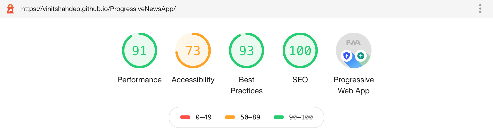

<h1>Progressive News App<sup>PWA</sup> </h1></a>

[](https://github.com/vinitshahdeo/ProgressiveNewsApp/blob/master/LICENSE) [](https://vinitshahdeo.github.io/ProgressiveNewsApp/) [](https://github.com/vinitshahdeo/)

**A simple Progressive Web App<sup>PWA</sup> that brought news from a variety of sources using [News API](https://newsapi.org/).** See [demo](https://vinitshahdeo.github.io/ProgressiveNewsApp/). 

> A **Progressive Web App (PWA)** is a web app that uses modern web capabilities to deliver an app-like experience to users. [Learn more about why **Progressive Web Apps** will replace native Mobile Apps](https://www.forbes.com/sites/forbestechcouncil/2018/03/09/why-progressive-web-apps-will-replace-native-mobile-apps/#5cfcb9702112).

### Getting started

To install [this](https://vinitshahdeo.github.io/ProgressiveNewsApp/) project, you need to clone or [download](https://github.com/vinitshahdeo/ProgressiveNewsApp/archive/master.zip) it.

```bash
git clone https://github.com/vinitshahdeo/ProgressiveNewsApp.git
cd ProgressiveNewsApp
```

<a href="https://vinitshahdeo.github.io/ProgressiveNewsApp/"></a>

#### :desktop_computer: [Live Demo](https://vinitshahdeo.github.io/ProgressiveNewsApp/)

### Running locally

- Serve folder with your server of choice. For instance by using `npm install -g serve`

- Make sure you are in the same path: `cd ProgressiveNewsApp`

- Run `serve .`

- Browse http://localhost:5000

- **Turn off your WiFi/Internet and see if it works :nerd_face:**


### [Light House](https://developers.google.com/web/tools/lighthouse) Report



### Useful Resources

- [Google Developers - Progressive Web Apps](https://developers.google.com/web/progressive-web-apps/)
- [News API](https://newsapi.org/)

### Recommended Reading

- [PWAs - Future of Mobile Web Browsing](https://www.wildnettechnologies.com/progressive-web-apps-prime-time-to-change/)
- [How is Progressive Web App different from Regular Web App?](https://www.websitepulse.com/blog/progressive-web-app-different-from-regular-web-app)

### Author

[](https://sourcerer.io/fame/vinitshahdeo/vinitshahdeo/ProgressiveNewsApp/links/0)[](https://sourcerer.io/fame/vinitshahdeo/vinitshahdeo/ProgressiveNewsApp/links/1)[](https://sourcerer.io/fame/vinitshahdeo/vinitshahdeo/ProgressiveNewsApp/links/2)[](https://sourcerer.io/fame/vinitshahdeo/vinitshahdeo/ProgressiveNewsApp/links/3)[](https://sourcerer.io/fame/vinitshahdeo/vinitshahdeo/ProgressiveNewsApp/links/4)[](https://sourcerer.io/fame/vinitshahdeo/vinitshahdeo/ProgressiveNewsApp/links/5)[](https://sourcerer.io/fame/vinitshahdeo/vinitshahdeo/ProgressiveNewsApp/links/6)[](https://sourcerer.io/fame/vinitshahdeo/vinitshahdeo/ProgressiveNewsApp/links/7)

**[Vinit Shahdeo](https://www.linkedin.com/in/vinitshahdeo/)**

<a href="https://twitter.com/Vinit_Shahdeo"></a> <a href="https://www.facebook.com/vinit.shahdeo"></a> <a href="https://www.linkedin.com/in/vinitshahdeo/"></a>


```javascript
if (thisRepo.isAwesome()) {
  // thanks in advance :p
  starThisRepository();
}

```

<sub><strong>If you find a bug or think something could be better, please file an issue! If you think a code change should be made, feel free to raise a PR.</strong></sub>

[](https://github.com/vinitshahdeo) [](https://twitter.com/Vinit_Shahdeo) [](https://github.com/vinitshahdeo/)


